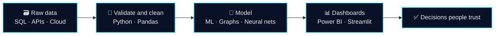

<div align="center">



[](mailto:awasthisanskritika@gmail.com)
[](https://www.linkedin.com/in/sanskritika-awasthi-9400592a6)
[](https://github.com/sanskritika2409)


> 🕵️ **Psst, look at the banner.** The pulsing **red nodes** are a money-laundering ring hiding in a transaction network.
> Finding rings like that is exactly what my [AML engine](https://github.com/sanskritika2409/Aml-Smurfing-Detection-Graph-Engine) does.


</div>

## 👩‍💻 `whoami`

```json
{
  "name": "Sanskritika Awasthi",
  "role": "Data Science & AI undergraduate",
  "education": "B.Tech CSE (Data Science & AI), SRMU Lucknow, 2023-2027, 82.30%",
  "superpowers": ["SQL", "Python", "Power BI", "graph ML", "FastAPI"],
  "shipped": ["live medicine marketplace", "AML detection engine", "Kubernetes-deployed scheduler (SIH 2025)"],
  "now": "Data Analytics training, May 2026 to present",
  "learning": ["system design", "LLM fine-tuning", "Airflow + dbt"],
  "open_to": ["Data Analyst", "Data Science", "ML / SWE internships and entry roles"]
}
```

### ⚙️ How I turn data into decisions



<details>
<summary><b>💬 Ask me about…</b></summary>
<br/>

- Detecting smurfing rings with **PageRank, betweenness centrality and autoencoders**
- Predicting churn **and** lifetime value with one multi-task neural network
- Shipping a marketplace from empty repo to live in **10 weeks**
- Deploying an AI scheduler on **Kubernetes** with zero-downtime rollouts

</details>

---

## 🛠️ Tech Stack

<div align="center">

| | |
|:--|:--|
| **Languages** |      |
| **Analytics & BI** |     |
| **ML & Data** |      |
| **Backend & Apps** |      |
| **Cloud & DevOps** |       |
| **Tools** |     |

</div>

---

## 🚀 Featured Projects

<table>
<tr>
<td width="50%" valign="top">

### 🛡️ AML Smurfing Detection Engine
Graph-based, unsupervised engine that detects smurfing / structuring rings in financial transaction networks and serves real-time structural risk scores via FastAPI.

- 25+ engineered features (PageRank, betweenness centrality)
- Hybrid **Isolation Forest + Autoencoder**
- **95% recall** across **10,000+ accounts**
- Streamlit dashboard for real-time risk scoring, ~40% less manual investigation time

`Python` `SQL` `NetworkX` `Scikit-learn` `FastAPI` `Streamlit`

[🔗 View Repository](https://github.com/sanskritika2409/Aml-Smurfing-Detection-Graph-Engine)

</td>
<td width="50%" valign="top">

### 🧬 Customer Digital Twin
Unified churn, LTV and recommendation API: a multi-task neural network plus Implicit ALS recommendations, with real-time decision orchestration and a What-If simulator.

- **0.87 AUC-ROC** (churn) · **<12% MAPE** (12-month LTV)
- Business-ready dashboards in Streamlit, Power BI and Tableau
- ~60% lower model-maintenance overhead

`Python` `Keras` `Pandas` `FastAPI` `Power BI` `Tableau`

[🔗 View Repository](https://github.com/sanskritika2409/Customer-Digital-Twin-AI-Engine)

</td>
</tr>
<tr>
<td width="50%" valign="top">

### 📅 Schedulon: AI Timetable Engine
Conflict-resolution scheduling engine for **Smart India Hackathon 2025** (PS-25091), generating FYUP and ITEP (NEP-aligned) timetables automatically.

- Conflict-free schedules, REST API and React admin/faculty UI
- Deployed on **Kubernetes** with zero-downtime rollouts

`Python` `React` `Docker` `Kubernetes`

[🔗 View Repository](https://github.com/sanskritika2409/AI_Timetable)

</td>
<td width="50%" valign="top">

### 🏥 Medi-Locator
Dual-sided medicine availability portal: map-based pharmacy discovery, real-time requests broadcast to nearby shops, and direct user-pharmacy contact. Shipped live.

- Shipped in **10 weeks**, **zero critical bugs**
- Geolocation, real-time medicine requests, pharmacy and user flows

`Django` `MySQL` `REST API` `JavaScript`

[🔗 View Repository](https://github.com/sanskritika2409/Medi-Locator)

</td>
</tr>
<tr>
<td width="50%" valign="top">

### 📦 SupplyChain-Env
OpenEnv-compatible AI benchmark environment that simulates supply chain crises, with a REST API and Docker deployment.

`Python` `FastAPI` `Docker`

[🔗 View Repository](https://github.com/sanskritika2409/-supply-chain-env)

</td>
<td width="50%" valign="top">

### 🧩 DSA Solutions
Curated LeetCode solutions organised by topic and difficulty, each with approach and time/space complexity.

`Java` `Python`

[🔗 View Repository](https://github.com/sanskritika2409/DSA--questions)

</td>
</tr>
</table>

### 📂 More Projects

| Project | What it does | Stack |
|:--|:--|:--|
| [📈 Retail Sales Forecasting & Inventory Optimization](https://github.com/sanskritika2409/Retail-Sales-Forecasting-Inventory-Optimization) | End-to-end demand forecasting and inventory optimization system | XGBoost · Streamlit · FastAPI |
| [💳 AI-Powered Financial Fraud Detection](https://github.com/sanskritika2409/AI-Powered-Financial-Fraud-Detection-System) | Detects fraudulent transactions from transaction patterns and customer behaviour | Python · ML |
| [🔐 Credit Card Fraud Detection](https://github.com/sanskritika2409/Credit-Card-Fraud-Detection) | Fraud classifier with SHAP explainability and a dashboard | XGBoost · SHAP · Streamlit |
| [📉 Customer Churn Prediction](https://github.com/sanskritika2409/customer-churn-prediction) | Identifies at-risk customers to enable data-driven retention | ML · Streamlit |
| [🔋 AI Energy Forecasting System](https://github.com/sanskritika2409/AI-Energy-Forecasting-System) | Predicts electricity usage with real-time predictions via Flask API | ML · Flask |
| [📊 Stock Market Data Analyzer](https://github.com/sanskritika2409/Stock-Market-Data-Analyzer) | Stock analysis dashboard with technical indicators | Streamlit · Yahoo Finance |
| [💬 Social Media Sentiment Dashboard](https://github.com/sanskritika2409/AI-Social-Media-Sentiment-Dashboard) | NLP sentiment analysis dashboard | NLP · Streamlit |
| [🛒 Smart Grocery Inventory Manager](https://github.com/sanskritika2409/Smart-Grocery-Inventory-Manager) | Full-stack inventory system with auth and stock monitoring | React · Node · MongoDB |
| [💬 Java Real-Time Chat App](https://github.com/sanskritika2409/Java-Real-Time-Chat-App-with-Socket-Programming) | Multi-client chat using TCP sockets and multithreading | Java |

<details>
<summary><b>🔌 Hardware, IoT &amp; VLSI projects</b></summary>
<br/>

- [Smart Home Automation (FPGA)](https://github.com/sanskritika2409/Smart-Home-Automation-FPGA) · [MMU Design (Verilog)](https://github.com/sanskritika2409/MMU-Design-Verilog-HDL) · [Low-Power ALU](https://github.com/sanskritika2409/Low-Power-ALU-Verilog-VLSI) · [Traffic Light Controller (FPGA)](https://github.com/sanskritika2409/FPGA-Traffic-Light-Controller) · [Digital Clock with Alarm (FPGA)](https://github.com/sanskritika2409/VLSI-Digital-Clock-Alarm-FPGA)
- [Air Quality Monitoring Dashboard](https://github.com/sanskritika2409/IoT-Air-Quality-Pollution-Monitoring-Dashboard) · [Vehicle Tracking &amp; Theft Prevention](https://github.com/sanskritika2409/IoT-Vehicle-Tracking-Theft-Prevention-System) · [Smart Agriculture Monitoring](https://github.com/sanskritika2409/IoT-Smart-Agriculture-Monitoring-System) · [Smart Waste Management](https://github.com/sanskritika2409/smart-waste-management-iot-system)

</details>

---

## 💼 Experience

| Role | Organisation | Period |
|:--|:--|:--|
| **Data Analytics Trainee** (SQL · Python · Excel · Power BI · Tableau) | Transcompe Educare Pvt. Ltd. | May 2026 – Present |
| **Django Full-Stack Developer Trainee** | Precursor Info Solutions | Jun – Aug 2025 |

**What I do day to day:** gather stakeholder requirements, extract and validate data with SQL and Python, build standardised Power BI / Excel dashboards, and deliver ad-hoc analyses that support leadership decisions.

---

## 🏅 Certifications

| Issuer | Highlights |
|:--|:--|
| **IIT Delhi EDC x IIP** | Data Science · Full-Stack Development · Machine Learning · Python |
| **Microsoft** | Data Science Certification · Data Analyst Certification |
| **Google** | Generative AI · AI Agent Intensive (with Kaggle, 2025–26) |
| **IBM / SAP** | IBM SkillsBuild: Watson Studio · SAP Analytics Cloud Badge |
| **Job Simulations** | AWS · JPMorgan Quantitative Research · Deloitte Data |
| **SQL** | Basic · Intermediate · Advanced |

---

---

<div align="center">


<br/>

[](mailto:awasthisanskritika@gmail.com)
[](https://www.linkedin.com/in/sanskritika-awasthi-9400592a6)

</div>

